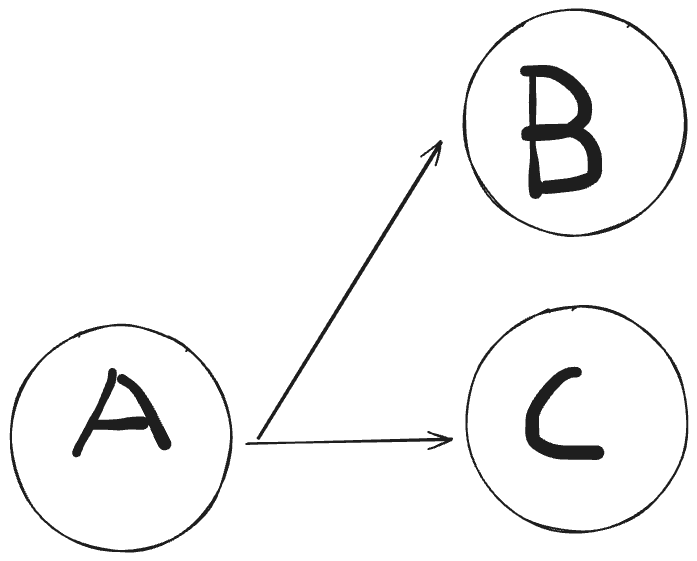

# Git에서 이전 소스로 되돌리는 방법
흔히 알고있는 깃에서 소스를 되돌리는 방법은 크게 두가지가 있다.

1. reset
2. revert

온라인에서 작업하는 경우 reset을 사용하면, reset의 동작 특성상 작업했던 이력을 전부 잃는 등, 사이드 이펙트가 있어 많이 사용하지 않는다.

revert를 많이 사용하는데, 이 revert는 reset과 어떤 차이가 있을까?

**흔히 revert는 수정한 이력을 남겨놓는 리셋으로 알고있다.**  이 설명을 듣고 명확하게 동작이 이해가는가?

나는 위의 설명이 이해가지 않았고, 실제로 어떤 원리로 동작하는지도 궁금했다.

오늘 오르미 4기에서 revert를 배웠고, 좋은 포스팅 글을 참고하여 정리해보고자한다.

## revert
revert의 컨셉은 이러하다.

**"기존의 수정사항을 제거한 커밋을 새로 추가한다."**  즉 

A -> B -> C의 커밋이 있을때, B에 대한 커밋을 revert하면 A의 수정 사항으로 돌린 revert 커밋 D를 추가하겠다는 것이다.

문제는 여기서 발생한다.

**"C에서 추가적인 작업이 있었다면, D커밋은 어떻게 만들어지지?"**

원론적으로는 A의 내역을 그대로 가져와 D라는 커밋을 만들어야한다.(지점을 기준으로 revert하는 것이므로)하지만, C라는 작업이 있으므로 git은 3-way-merge 기법을 사용하여 자동 머지를 한다.

그러면 자동 머지가 안되는 상황이 있을것이다.




B 커밋과 C 커밋에 동일한 파일에서 겹치는 상황이 있을경우 merge시 병합 충돌이 나는 것은 익히 알고 있다.

revert역시 마찬가지다. 자동으로 3-way-merge 기법을 사용하며 머지를 하다가 병합 충돌이 나는 경우인것이다.

## 충돌 해결 방법

### 1.병합 충돌을 수동으로 해결하고, revert를 속행한다.
병합 충돌을 해결 한 뒤 다음과 같은 코드를 입력하면 revert가 완료된다.

```shell
git add .

git revert --continue
```

여기서 git revert --continue는 충돌을 해결하였으니, 기존에 하던 revert 동작을 이어가라는 뜻이다.
참고 링크: [git revert Doc](https://git-scm.com/docs/git-revert/2.6.7)

### 2. 커밋을 stack 처럼 revert처리한다.
커밋은 sequencial한 자료이므로 역순으로 하나하나 revert처리를 한다.

- 충돌은 나지 않겠지만, 작업이 번거롭고 revert 커밋 로그 역시 많이 남을 것이다.

