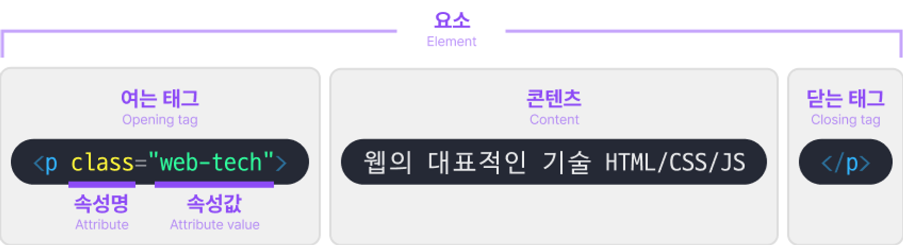

# 요소 분석
HTML은 요소들의 집합으로 구성된 표현 언어이다.

우리는 "HTML 태그" 용어를 많이 듣는데, 요소와 태그가 무엇으로 구분될까?


[ 출처: 이스트소프트 백엔드 오르미 4기]

그림을 보면 어느정도 이해가 간다. 하지만 중요한 것은 문장으로 기억하는 것이므로 정리해보자.

요소를 보면 내부에 여는 태그, 콘텐츠, 닫는 태그로 이루어져있다.

또한, html 구조를 생각해보면 콘텐츠 내부에 또 다른 요소가 들어감도 예상해볼 수 있다.

용어를 정의해보자.
### 요소
> **요소란, 태그와 요소를 포함할 수 있는 콘텐츠로 이루어진 집합**

요소중에는 여는 태그와 닫는 태그가 합쳐지고, 콘텐츠가 없는 요소가 있는데 이를 **빈 요소**라 한다.
ex)
```html
<br >
<input >

```

HTML은 Self-Closing 태그를 사용할때 태그 마지막에 "/"를 붙이지 않아도되지만, XHTML은 반드시 붙여야한다.
- 사실상 안붙여도된다. HTML 스탠다드에서 통합된 내용

