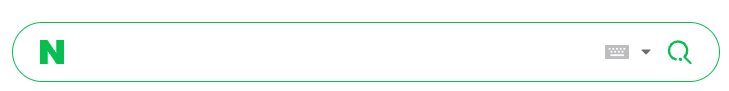

웹은 접근성이 매우 중요하다.

OTT, TV 프로그램들이 청각 장애인을 위해 자막 서비스, 수화를 제공하듯 웹 역시 불편함이 있는 사람들이 불편함 없이 서비스를 이용할 수 있도록 해야한다.

이를  WAI(Web Accessibility Initiative)라하고, 한국에서는 WA라하여 웹 접근성 준수가 법적 의무사항으로 지정되어있다.
출처: [한국웹접근성인증평가원](https://www.wa.or.kr/m1/sub1.asp)

-----

# IR (Image Replacement)
웹 접근성을 충족하기 위한 요법중 하나로, **이미지를 볼 수 없는 사용자에게 적절한 대체 텍스트를 제공하는 방법**
이다.

IR을 제공하기 위하여 필요한 조건은 두가지이다.

1. 스크린 리더가 대체 텍스트 요소를 인식할 수 있어야한다.
2. 대체 텍스트 요소는 반드시 시멘틱한 위치에 배열되어야한다.

____

IR기법은 아래와 같이 쓰인다.
```html

<p class="ir_p">
	이미지에 들어갈 설명이 여기에 들어갑니다. alt로 한번에 보여주기 힘든경우나, css background로 image를 로딩했을 경우 설명을 적기 위하여 사용합니다.
</p>
```

### 실 사례
naver에서 쓰는 IR기법은 어디에 있을까?


다음과 같이 naver 검색창이 있을때, 이미지 왼쪽에 "*N*" 로고와 "*검색*" 아이콘 아래에 IR기법이 적용되어있다.
(네이버는 IR기법으로 입력한 요소의 클래스 명을 blind로 명시한다)

```css
/* naver blind 클래스  */

position: absolute;
clip: rect(0, 0, 0, 0);
width: 1px;
height: 1px;
margin: -1px;
overflow: hidden;
```

clip: rect(0,0,0,0) 은 요소를 사각형으로 본 딴뒤 얼마만큼 보여줄 것인지 결정한다.
0,0,0,0은 아무것도 보여주지 않겠다는 의미다.

width, height: 1px은 width, height가 0일경우 스크린리더가 인식하지 못하는 경우가 존재하여 기본적인 크기를 준것이다.

또한 margin: -1px;로 width, height에 지정된 1px을 줄인다.

결과적으로 IR 요소는 UI에 영향을 주지 않되 시멘틱하게 보여줄 수 있는 것이다.