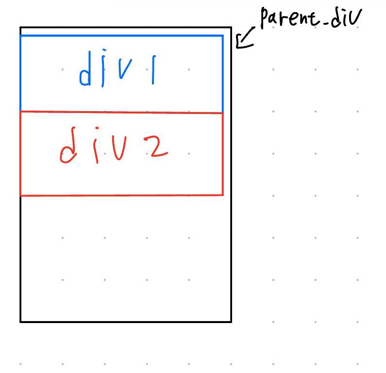
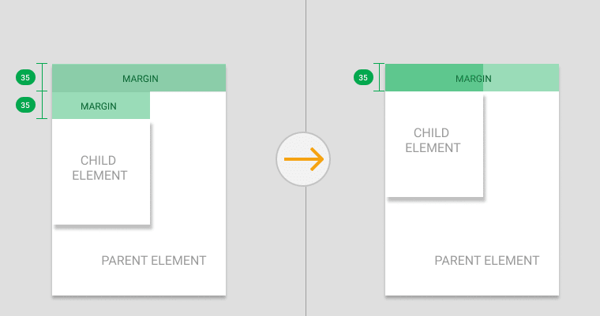

# 일반흐름(normal flow)?
[[쌓임 맥락]]은 여러번 들어본적이 있으나, 일반 흐름은 들어본적이 없다. 이번에 왜 이런 단어가 발생한건지 확인해보고자한다.

쌓임 맥락은 요소와 자식 요소간 어떤 것이 화면 상 맨 앞에 배치될 것인가를 결정한다.(z축)

그렇다면 일반 흐름은 무엇을 뜻할까?

reference 링크를 참조해보면 다음과 같이 나온다

> 💡"This article explains normal flow, or the way that webpage elements lay themselves out if you haven't changed their layout."

> "웹페이지의 배치를 우리가 수정하지 않았을 때, 어떻게 요소가 웹페이지에 스스로 배치되는지를 다룹니다."

유추해보자면, 우리가 html 태그로 페이지를 배치할때 배치되는 흐름을 명시한다 볼 수 있다.

또한 MDN문서에서는 문서가 일반 흐름을 따라가는 것이 브라우저에 종류를 배제할 수 있는 좋은 방법이라 소개한다. (웹 표준이 아닌 CSS는 브라우저마다 지원여부가 다를 수 있다.)

프론트 개발의 특성상 [[크로스 브라우징]]은 중요한 필요 조건이다. 크로스 브라우징을 지원하기 위해 여러 기준들이 있겠지만 모바일 기기, 웹페이지 화면 크기 별 레이아웃 배치는 골치가 많이 아픈 내용 중 하나일 것이다.

이를 일반 흐름에 맞춰 개발한다면 레이아웃의 변경을 별도로 고려하지 않거나, 고려하더라도 일반 흐름을 반영하지 않은 웹 페이지의 레이아웃의 변경을 하는 것보다는 간편하게 변경 할 수 있을 것이다.

## 블록 요소, 인라인 요소의 특성
블록 요소는 부모 요소의 width를 가득 채우는 방향으로 크기를 늘린다.
인라인 요소는 자신의 콘텐츠 내용만큼 크기를 갖는다.

그렇다면 이런 요소들을 섞을 때, 어떤 방식으로 배치가 될까?

위에서 **일반 흐름**을 유추했었는데, 이제 정의를 정확히 명시해보겠다.

> 💡 "the system by which elements are placed inside the browser's viewport"

 > 🖋️ **브라우저 뷰포트 내부에 요소가 배치되는 시스템**

 요소가 document에 배치되는 방법(흐름)이 일반 흐름이라 할 수 있겠다.

## 블록 요소, 인라인 요소의 배치 방식

우리가 별도로 position이나, float와 같이 페이지 레이아웃을 변경하지 않는 이상 block요소와 inline 요소는 다음과 같이 배치된다.

###  블록요소
블록 요소는 자신의 부모요소가 요소를 배치하는 방법에 따라 배치된다.

블록 요소는 기본적으로 하위 요소를 수직으로 쌓는다. 이는 부모요소의 writing-mode를 따라가게된다.
- 여기서 writing-mode는 **하위 요소가 어느 방향으로 쌓이게되는지 결정하는 속성이다.** [writing-mode](https://developer.mozilla.org/en-US/docs/Web/CSS/writing-mode)를 참조하면 좋다
- 하위 요소를 수직으로 쌓는것은 writing-mode의 기본값이 horizontal-tb이기 때문이다. 
### 인라인 요소
인라인 요소는 블록 요소와 달리 인접한(혹은 인라인 요소를 덮는) 요소의 크기가 자신이 들어갈만한 여유공간이 있을 경우, 같은 라인에 배치됩니다.

만약, 인라인 요소의 크기가 래퍼 요소의 크기보다 클 경우, **넘어가는 크기만큼 다음 line으로 넘어간다**
- *line-height는 넘어가는 라인의 크기를 지정.

### 마진을 갖는 요소의 배치
수직으로 배치된 요소들의 마진이 서로 touch가 되는 경우

출처: [Margin Collapse Explained by Images](https://dev.to/camfilho/margin-collapse-explained-by-images-361e)
일반 흐름상 두 요소의 마진 중 큰 마진만 적용하고, 작은 요소의 마진은 무시해버린다.

이는 부모-자식 , 형제-형제, 특정요소-특정요소간 발생할 수 있다. 트리거는 오직 **vertical하게 배치된 요소의 마진이 일반흐름상 겹칠 경우**이다.

##### 위의 현상을 뭐라고 부르지..
이런 현상을  **마진 겹침**이라 명명하여 부르고있다.
