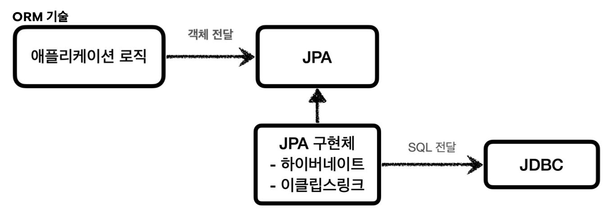

## JDBC의 한계
자바에서 JDBC 인터페이스를 의존함으로써 다양한 DB를 편하게 사용할 수 있게 되엇다.

하지만, JDBC도 한계가 존재한다. 

### SQL의 통일성 부재
1. ANSI표준 SQL이 존재하나, 실제 데이터베이스는 세부적으로 다른 SQL구문을 갖는 경우가 많다.

따라서, 개발자는 DB가 바뀔 때마다 쿼리문을 다르게 써야하는 번거러움이 있다.

2. 응답객체에서 필요한 값을 사용하기 번거롭다.

개발자가 쿼리문으로 가져온 응답 객체는 비즈니스 로직에 바로 적용하기 어려운 문제가 있었다.

## 대체제
### SQL Mapper
기존에 JDBC와 어플리케이션 로직이 직접 연결되어있었다면, JDBC와 어플리케이션 로직을 간의 연결을 중재하는 역할을 수행한다.

장점: JDBC를 편하게 사용할 수 있다.
1. SQL 응답 결과를 객체로 편리하게 변환해준다.
2. 동적쿼리를 지원하여 JDBC가 갖는 반복 코드를 제거한다.
단점: 개발자가 SQL을 직접 작성해야한다.

**대표 기술\:** Jdbc Template, mybatis

### ORM(Object Realation Mapping)

어플리케이션 로직 -> JDBC 인터페이스로 맺고 있던 연결관계를 어플리케이션 로직->JPA 인터페이스로 맺게 함

ORM의 가장 큰 특징은 DB의 연관 관계를 객체로 표현한다는 점임

즉 A테이블과 B테이블이 서로 연관관계가 있을 때, 이를 A객체 B객체로 표현해줌

장점:SQL자체를 작성하지 않아도되어 개발 생산성이높아짐
단점:학습 곡선이 SQL Mapper에 비해 큼

## 근데.. JDBC는 어디가나 있다
SQL Mapper, JPA구현체는 모두 일종의 JDBC프록시이다.
-> 근본적인 원리를 알아야 SQL Mapper, JPA 구현체의 기술들을 더욱 더 깊게 이해할 수 있다.

