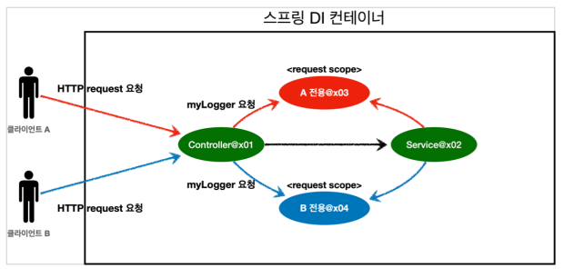

## 빈 스코프
우리는 지금까지 빈이 스프링 컨테이너의 시작과 종료까지 같이 간다고 알고있었다.
지금까지는 스프링 빈이 싱글톤 스코프로 생성되기 때문이다. 이외에도 여러 스코프들이 있는데, 한번 확인해보자

### 빈 스코프 종류
1. **싱글톤**:기본 스코프, 스프링 컨테이너의 시작과 종료까지 유지되는 가장 넓은 범위의 스코프
2. **프로토타입**: 스프링 컨테이너는 프로토타입 빈의 생성과 의존관계 주입까지만 관여하고, 더는 관리하지 않는 매우 짧은 범위의 스코프이다.
3. **웹 관련 스코프**
	- **"request"**:웹 요청이 들어오고 나갈때까지 유지되는 스코프
	- **"session"**: 웹 세션이 생성되고 종료될 때까지 유지되는 스코프
	- **"application"**: 웹의 서블릿 컨텍스트와 같은범위로 유지되는 스코프


#### 프로트타입 스코프
싱글톤 스코프의 빈을 조회하면 스프링 컨테이너는 언제나 같은 빈을 반환한다. 하지만 프로토타입 스코프의 빈을 컨테이너에 요청하면 매번 새로운 빈을 반환한다.

1. 클라이언트가 프로토타입 스코프의 빈을 요청한다.
2. 요청 시점에 프로토 타입 빈을 생성하고, 필요한 의존관계를 주입한다.
3. 스프링 컨테이너는 생성한 프로토타입 빈을 클라이언트에 반환한다.
1~3을 반복한다.

핵심은 스프링 컨테이너가 생성 및 의존 관계 주입 이후의 프로토타입 스코프의 동작을 관여하지 않는다는 점이다.
따라서, `@PreDestroy`와 같은 어노테이션은 동작하지 않는다.
-> 프로토타입 빈을 받은 클라이언트가 이를 관리할 책임을 갖는다.

> 여기서 클라이언트는 웹 클라이언트가 아니다!!
> getBean같은 메서드로 빈을 가져올 때마다 생성 및 DI가 이루어지는 것이다.

그렇다면, 이런 프로토타입 빈은 언제 사용할까?
- 싱글톤 스코프 빈은 컨테이너에 지속적으로 적재되어있는 특징이 있다. 이는 가끔 일어나는 로직과 관련된 빈도 계속 메모리에 적재되어있다는 문제가 될 수 있다.

#### 프로토타입 스코프 - 싱글톤 빈과 함께 사용시 문제점
스프링 컨테이너에 프로토 타입 스코프 빈을 요청하면 항상 새로운 객체 인스턴스를 생성하여 반환한다. 

##### 프로토타입 빈을 직접 요청하는 경우
**스프링 컨테이너에 프로토타입 빈 직접 요청 1**

1. 클라이언트가 프로토타입 빈을 요청한다
2. 스프링컨테이너가 프로토타입 빈 생성, 반환을 진행한다
3. 클라이언트는 프로토타입 빈 내부 count를 증가시키는 로직을 수행한다.

**스프링 컨테이너에 프로토타입 빈 직접 요청  2**

1. 클라이언트가 프로토타입 빈을 요청한다
2. 스프링컨테이너가 프로토타입 빈 생성, 반환을 진행한다
3. 클라이언트는 프로토타입 빈 내부 count를 증가시키는 로직을 수행한다.

자.. 그렇다면 각 클라이언트가 갖는 count는 초기값이 0일 때 모두 1이 될것이다.


##### 싱글톤 빈에서 프로토타입 빈을 인자로 받는경우
이번엔 `clientBean` 싱글톤 빈이 의존관계 주입을 통해 프로토타입 빈을 주입받아 사용하는 예를 보자.

1. `clientBean` 싱글톤 빈은 생성시점에 의존관계 주입에 의해 프로토 타입 빈을 전달받아야한다고 스프링 컨테이너에게 요청한다.
2. 스프링 컨테이너는 프로토타입 빈을 생성하여 `clientBean`에 반환한다. 이때, 프로토타입 빈의 count는 0이다.
3. `clientBean`은 프로토타입 빈을 내부에서 보관한다.(참조값 보관)

**그 다음**

1. 클라이언트 A(고객)은 `clientBean`을 스프링 컨테이너에 요청해서 받는다. 싱그롵이므로 항상 같은 `clientBean`이 반환된다.
2. 클라이언트 A는 프로토타입빈의 addCount를 호출한다.
3. `clientBean`은 클라이언트 A에게 count 1를 반환한다.

**여기까지는 문제가 없다.**

1. 클라이언트 B는 `clientBean`을 스프링 컨테이너에 요청해서 받는다. 싱글톤 빈이므로 항상 같은 `clientBean`을 반환한다.
	- **여기서 중요한 점은, 싱글톤 빈이 가지고있는 프로토타입 빈은 이미 DI가 끝난 빈이다. 사용자가 요청할 때마다 새로 생성하는 것이 아니다. **
2. 클라이언트 B는 프로토타입 빈의 AddCount를 호출한다.
3. `clientBean`은 클라이언트 B에게 count 2를 반환한다.

**여기서 문제가 무엇일까?**

싱글톤 빈은 별도 상태를 가지고 있으면 안된다!

자 뭐가 문제일까?

다시 생각해보자. `clientBean`에서 특정 Bean을 보관하고 싶다 가정하자.

어차피 프로토타입 빈이든 싱글톤 빈이든 `clientBean`에서 참조를 하고 있기 때문에 메모리에서 사라지지 않을것이다.

위의 로직을 싱글톤 빈으로 갈아끼웠을때, 로직의 변화가 발생할까?
> 참고
> 프로토 타입 빈은 주입 시점에 매번 생성된다. 프로토 타입 빈을 주입받는 싱글톤 빈의 인스턴스가 여러개라면 각 싱글톤 빈이 가지고 있는 프로토타입 빈은 다른 인스턴스이다.

전혀 아니다.

그렇다면 프로토타입 객체를 써서 **'프로토 타입 빈이지만, DI 시점에서 주입된 이후 `clientBean`이 계속 사용하므로, `clientBean`의 생명주기가 끝날 때까지 프로토 타입 빈이 남아있겠구나!'** 라고 한번 더 생각하는 과정이 필요할까?

***개발자는 게으르다. 파악할 것을 줄이고, 복잡성을 피한다***.

따라서, 우리가 원했던 로직이 지속적인 상태를 보관하는 것이였다면, 싱글톤 빈을 사용하는 것이 더 적합했을 것이다.

그렇다면 싱글톤 빈 객체 안에서 프로토타입빈을 보관하되, 사용자가 요청할 때 마다 서로 다른 프로토타입 빈 인스턴스를 반환하려면 어떻게해야할까?

`clientBean`이 컨테이너를 참조하고, `logic()`실행시 매번 getBean으로 새로운 프로토타입 빈을 받을 수 있다.(이를 Dependency Lookup이라 한다)

### 우리는 프로토타입 빈만 찾아주는 객체가 필요하다.
DL 기능만 제공하는 것은 없을까?

#### `ObjectFactory`, `ObjectProvider`
스프링 의존적이지만, DL작업이 편해질 수 있도록 도와준다.
-> 스프링 컨테이너를 통해 제네릭 타입으로 선언되어있는 빈을 찾아 반환한다.


#### `JSR-330 Provider`
자바 표준 방법을 사용하는 방법이다.
gradle에 라이브러리를 추가해야한다.

DL을 도와주는 Provider를 스프링이 아닌 다른 곳에서도 사용할 수 있을까?
-> 가능하다!

이런 Provider는 언제 필요할까?

프로그램을 짜다보면... 가끔이지만 클래스 A와 B가 서로 순환 의존하는 경우가 있다.

이럴 경우 Provider를 사용한다.


### 웹 스코프
웹스코프 빈은 웹 환경에서만 동작하는 특수한 스코프이다.
-> 스프링이 종료시점까지 관리한다.

**종류**
	"request": HTTP요청 하나가 들어오고 나갈 때까지 유지되는 스코프, 각각의 HTTP 요청마다 별도의 빈 인스턴스가 생성되고 관리된다.
	"session": HTTP session과 동일한 생명주기를 갖는 스코프
	"application": 서블릿 컨텍스트(`servleContext`)와 동일한 생명주기를 갖는 스코프
	"websockect": 웹 소켓과 동일한 생명주기를 갖는 스코프

**클라이언트 A, B가 각각 request를 보내는 경우**


controller에서 클라이언트 A,B의 요청을 받으면 각 클라이언트에 request에 매핑되는 request 스코프 빈을 만든다.

그래서 일반적인 싱글톤 빈에 DI주입시점에 requestBean을 주입하려하면 당연히 에러가 뜬다!
-> provider로 해결한다.

그런데... provider도 귀찮아하는 우리 개발자들은 방법을 찾았다.


### 스코프 프록시
provider를 사용하려면 클래스 멤버 프로퍼티에 provider를 선언하고, request 스코프 빈이 필요할 때마다 provider로부터 request 스코프 빈을 생성받아 사용해야한다.

가능하다면, 아무생각 없이 request 스코프 빈을 사용하던 것처럼 사용할 수 없을까?
- **그것이 실제로 있습니다.**

```java
@Component
@Scope(value = "request", proxyMode = ScopedProxyMode.TARGET_CLASS)
public class MyLogger{
....
}
```

request Bean 클래스 위에 다음과 같이 `@Scope`어노테이션을 작성하면, `MyLogger` 빈을 사용하는 다른 스프링 빈에서 오류가 나지 않도록 스프링에서 지원한다.[프록시]

**어떻게?**

어노테이션에 `proxyMode = ScopedProxyMode.TARGET_CLASS`를 적으면, 스코프가 일종의 프록시를 사용한 가짜 객체를 생성해서 DI를 처리한다.
-> 이후 실제 request Scope 빈이 필요할 때! 실제 객체를 생성하여 처리한다.
