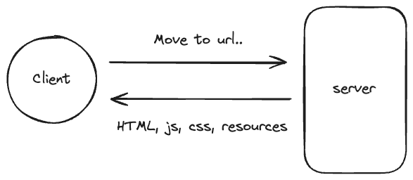
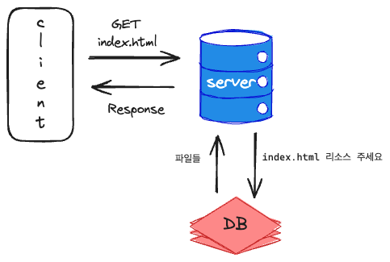
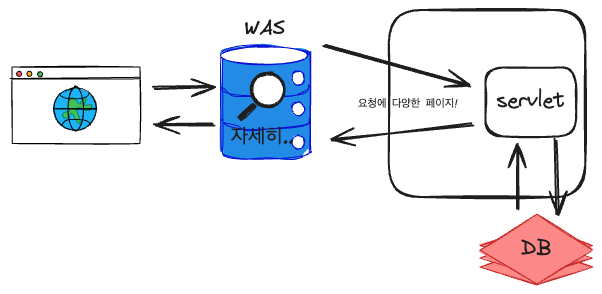

# Web Server, Web Application Server
HTTP(하이퍼 텍스트 전송 프로토콜)은 링크로된 문서를 보여주기 위해 만들어진 프로토콜이다. 그렇다면 초기의 웹 서버를 생각해보자. 

가장 간단한 형태의 웹서버는 링크로 연결된 HTML파일과 그에 관련된 JS, CSS, 리소스를 **정적**으로 제공하는 서버일 것이다.

하지만, 생각해보자 우리는 웹서버에서 정적인 데이터만 보고있지 않다. '나'의 정보를 토대로 웹 화면에 추천 상품, 광고, 권한에 따른 글 목록 등 클라이언트마다 별도로 구분된 데이터를 서버는 제공하고있다. 

## Business Logic
위에서 설명한 동적인 데이터 과정을 추상화하면 다음과 같이 추상화 할 수 있다.

> 클라이언트가 요청한 정보를 받은 서버가 알맞은 응답을 동적으로 제공하기 위해 필요한 일련의 과정

이를 비즈니스 로직이라 부른다.

즉 사용자별 추천, 광고, 권한제어 등 서비스를 제공하기 위해 필요한 로직을 비즈니스 로직이라 부를 수 있다.

그렇다면 이런 비즈니스 로직을 처리하고, 동적인 응답을 클라이언트에게 전달하기 위해 웹 서버는 어떤 구조를 가지고 있을까?

## Web Application Server

웹 어플리케이션 서버를 설명하기 위해 웹페이지의 종류를 조금 더 세분화하자.

### 1. 정적 웹 페이지

정적 웹페이지는 언제나 동일한 요청에 대해 언제나 동일한 response를 제공한다.

### 2. 동적 웹 페이지

서버가 클라이언트가 요청한 데이터를 받으면, 추가적인 처리 과정을 거쳐 클라이언트에게 동적인 응답을 보냅니다.

그렇기 때문에 다양한 페이지를 보여줄 수 있습니다. 

이런 페이지는 당연히 HTML, CSS, JS만으로는 만들 수 없으므로(DB와 통신 및 데이터 처리가 필요하므로) Java같은 언어로 다양한 페이지를 제공하기 위한 비즈니스로직을 처리합니다. 그 이후 HTML문서에 이를 재 조립하여 서버에서 클라이언트에게 전달합니다.

이런 동적 웹페이지를 보여주기 위해 필요한 것이 웹 어플리케이션 서버입니다.

### 웹 어플리케이션 서버 구성

실제 웹 서비스의 구성은 웹 서버와 웹 어플리케이션 서버로 구성되어있습니다.

웹 서버는 정적인 데이터를 요청하면 정적인 데이터를 응답합니다. 만약 동적인 Request일 경우, 이를 웹어플리케이션 서버에 전달하고, 웹 어플리케이션 서버에서 전달한 응답을 클라이언트에게 전달합니다.

> 하지만 CSR(Client Side Rendering)으로 인해 무조건 html 파일을 전달하지는 않는다. 초기에 웹서버가 전달한 js파일로 클라이언트단에서 화면 렌더링을 처리하고, 웹서버가 API의 응답값만 전달하는 경우도 존재한다. 

### 웹 어플리케이션의 기능
1. 프로그램 실행 환경과 DB 접속 기능
2. 트랜젝션 관리
3. 업무를 처리하는 비즈니스 로직 수행

### 웹 어플리케이션 동작 순서
1. 웹서버가 요청을 넘겨준다.
2. 웹 컨테이너는 요청을 처리하는데 참조 서류인 web.xm을 참조하여 서블릿을 생성하고, httpServletRequest, httpServletResponse 객체를 생성하여 전달한다.
3. 컨테이너 스레드가 서블릿을 호출한다.
4. doGet(), doPost()메서드가 인자에 맞게 생성된 적절한 동적 페이지를 응답 객체에 담아 WAS에 전달한다.
5. WAS가 이를 HttpResponse 형태로 바꾸어 Web Server에 전달한다.
6. 컨테이너 스레드는 생명주기를 다했으므로 삭제된다.

### 근데 왜 웹서버를 사용하지?
웹 서버는 일종의 캐시 역할을 수행한다.

스레드를 생성하고, 메서드를 호출하는 과정은 모두 오버헤드가 존재하는데, 웹서버에서 정적인 데이터를 바로 제공하므로써 이런 불필요한 생성 - 삭제 과정을 스킵할 수 있는 것이다.

