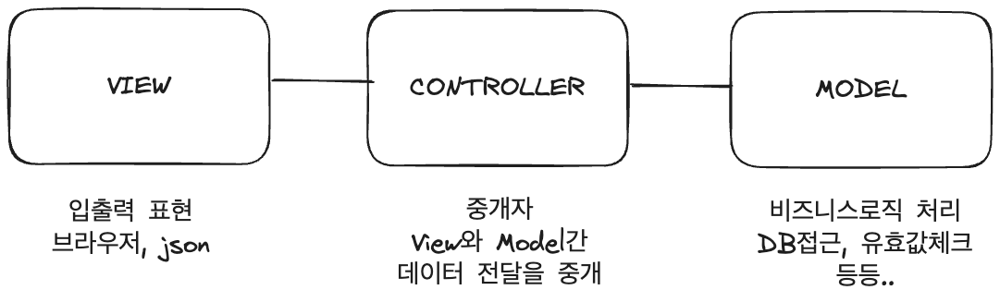
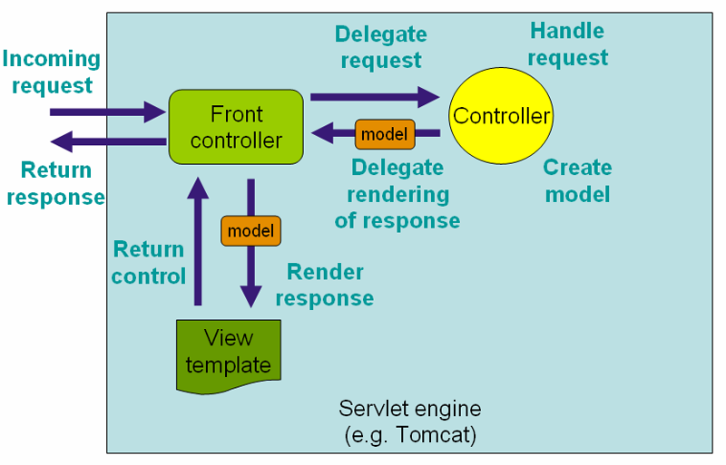

## MVC (Model, View, Controller)

프로그램의 처리 역할을 나누어 프로그램을 작성하는 방법 중 하나로 디자인 패턴

프로그램의 역할을 모델, 뷰, 컨트롤러 세가지로 나누어 역할에 맞는 코드를 설정하도록 하는 경우

### MVC가 뭐가 이득이지?
MVC로 코드의 역할을 분업화 시켰다 생각하자. 무엇이 좋을까?

직관적으로 생각되는 이점은 아래와 같다.

> 1. "보여지는 화면(html, css)는 고정한 상태로, 내가 원하는 비즈니스 로직만 변경할 수 있다."
> 2. 하나의 파일에 다양한 역할이 혼재되지 않아, 개발자가 로직을 파악하기 용이하다.

### MVC의 역할

## 스프링에서 MVC
스프링의 MVC는 위의 MVC패턴에서 발전된 형태를 가지고있다.

스프링에서 **Model**은 비즈니스 로직을 거치고 온 후 뷰에 전달되기 위한 정보를 담은 객체를 의미한다.

스프링의 MVC는 아래와 같은 구조를 갖는다.

> 1. Front Controller(서블릿 dispatcher)가 요청을 받고, 적절한 Controller에게 요청을 위임한다.(전화 교환원같이)
> 2. 컨트롤러가 비즈니스 로직을 처리하고, 뷰에 필요한 정보를 담은 객체인 Model을 만들어, Front Controller에게 전달한다. 
> 3. 프론트 컨트롤러는 전달받은 모델을 기반으로 적절한 view template을 찾아, Model 객체를 전달한다.
> 4. view template은 Model객체를 기반으로 요청자에게 적절한 뷰를 제공한다.

#### 여기서 핵심!
Spring의 MVC 패턴을 유심히 살펴보자. 여기서 가장 주목해야하는 설계 방향은 무엇일까?

나는 위임, 관심사의 분리라 생각한다.

프론트 컨트롤러는 request, model에 대한 적절한 매핑을 담당하고, 그 이후의 처리는 매핑되는 객체에 위임한다.

컨트롤러 역시 마찬가지다.

전달받은 요청으로 비즈니스로직을 수행하고, 수행한 후 자신이 처리해야하는 부분 이외의 정보는 Model객체에 담아 넘겨버린다.

즉 MVC 패턴의 설계원칙은 반드시 지켜진다!

만약, MVC패턴으로 프로그램을 설계한다면 반드시 역할의 분리 및 간섭 금지의 원칙을 지켜야할 것이다.