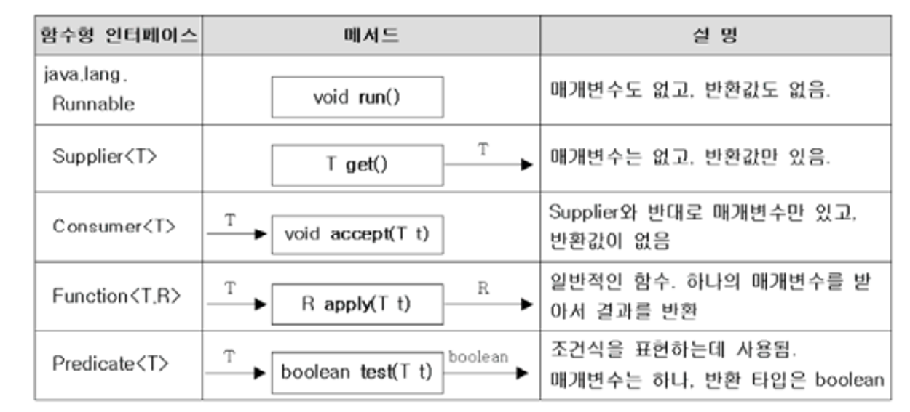

# 함수형 인터페이스

우리는 Single Abstract Method(SAM)은 람다식으로 표현 할 수 있음을 알고있다.

그렇다면, SAM은 어떤 방식으로 사용할 수 있을까?

우리는 Thread, Stream에서 Predicate, Runable등 람다식을 사용하지만 입력 및 반환값이 고정된 메서드를 많이 확인할 수 있다.

즉, 메서드가 매개변수로 함수형 인터페이스를 받음으로써 매개변수의 타입을 지정한 효과를 얻을 수 있는 것이다.

## 자주 사용하는 함수형 인터페이스의 종류

출처: 자바의 정석

### 함수형 인터페이스의 이점
위의 표로 나와있는 함수형 인터페이스의 이름은 일종의 Prefix로 표현된다. 즉, 'XXXSuplier는 XXX를 반환하는 서플라이어겠구나!'라 추론할 수 있다.

## 메소드 참조
stream 메서드를 쓰다보면...

```java
%% 리스트 출력 메서드 %%
void printList(){
	List<Integer> list = new ArrayList<>();

%% 리스트 객체 추가... %%


	list.stream().forEach(System.out::println);
}
```
System.out::println 이부분에 집중해보자.

자바를 배우면서 이런 형태의 메서드는 본 적이 없다.

출력 한 결과값은 리스트의 원소값이 출력된다.

어떻게 이런 일이 일어나는 걸까?

### 코드의 축약을 위한 또하나의 기술.
정답은 System.out.println 메서드를 참조한 것이다.

이를 **메서드 참조**라 부른다.

메서드 참조는 두가지 방식이 존재한다. 사실 동일한 원리이나 구분의 편의상 아래 처럼 구분하는 듯하다.

#### 정적 메서드 참조
정적 메서드를 참조하는 경우

정적 메서드를 포함하는 클래스명:메서드명

#### 인스턴스 메서드 참조
인스턴스 메서드를 참조하는 경우

인스턴스명::메서드명

#### 생성자 참조
자바에서 생성자 역시 메서드이다..!

즉, 생성자 역시 메서드 참조를 통해 표현할 수 있다는 이야기이다!

클래스명::new은 매개변수로 받은 인자들로 생성자를 호출함을 암시하는 생성자 참조이다.