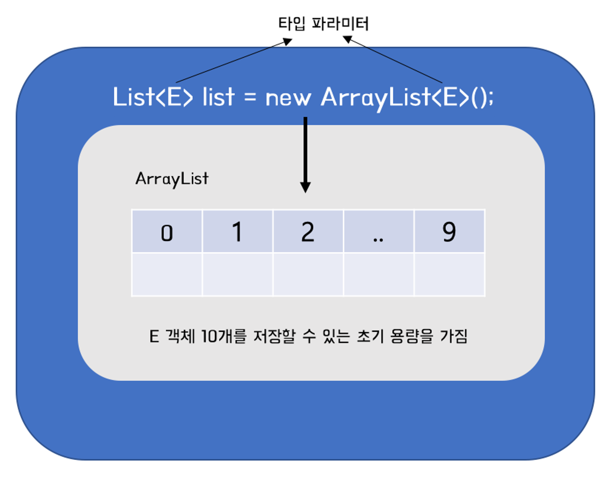
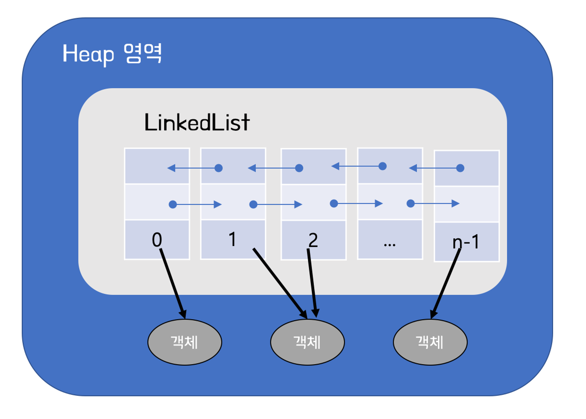

# 리스트
우리는 연속적으로 데이터를 저장하기 위해 배열을 사용할 수 있다.

하지만, 배열은 고정적인 크기를 갖는 단점이 있다.

리스트 컬렉션은 객체를 일렬로 늘어놓는 구조를 인터페이스로 나타낸다.

이런 리스트 컬렉션을 구현하는 것은 크게 ArrayList, LinkedList 두가지가 존재한다.

각각 어떤 차이가 있는 것일까?

## ArrayList
ArrayList는 Array 형태의 리스트를 의미한다.

연속된 주소값을 갖는다.

객체를 생성할 때, 파라미터로 int 값을 넣을 경우 제네릭 타입의 연결된 메모리 공간을 몇개 할당 받을 것인지 기입할 수 있다.

만약 add 메서드 호출로 리스트의 크기가 capacity를 넘게되면, **capacity 증가 및 새로운 메모리 할당 & 복사** 과정이 수행된다.

따라서, 탐색 시간이 O(1)인 장점이 존재하나, 빈번한 객체 생성 및 삽입 삭제가 일어날 경우 성능상 이슈가 존재한다.

## LinkedList

링크드 리스트는 각 요소의 연결을 참조를 통해 진행하는 리스트이다.

따라서, 메모리의 연속된 할당이 강제되지 않아 ArrayList에 비해 상대적으로 성능상 이점이 존재한다. 하지만, 탐색 시간이 O(n)이 소요된다는 단점 역시 존재한다.