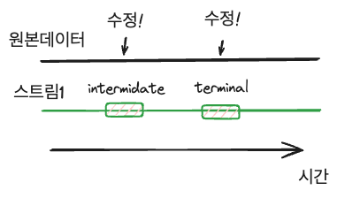
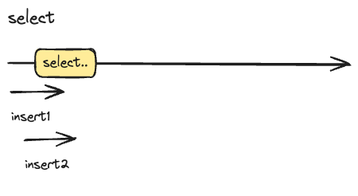

# 자바 코테.. 나만 코드가 길어
이스트소프트 오르미 4기 교육을 시작하고, 백엔드 개발을 위해, 코딩테스트 언어 변경을 위해 다시 자바 언어를 공부하고있다.

기본적인 문법에 익숙해지기 위해 프로그래머스 기준 LV.0 문제부터 풀고있는데 매우 어려움이 많다.

1. 형변환이 매우 어렵다. 래퍼 클래스 -> 기본 자료형으로 변경의 경우나 기본 자료형 -> 래퍼 클래스 자료형으로 변경할 때 알아야할 메소드가 너무나도 많다.
2. 코딩테스트를 풀면서 상황별로 필요한 기능(문자열 추출, 슬라이싱)이 너무나 많은데, 내가 java에서 어떤 메소드를 써야하는지 전혀 알지 못한다.

코딩 테스트의 문제를 푸는것보다 위의 어려움 때문에 문제를 푸는데 애를 먹다니...

약간 현타가 와서 다른 사람들은 어떻게 문제를 해결했는지 확인해보자는 마음이 들었다.

``` java
import java.util.stream.IntStream;

class Solution {
    public int[] solution(int start, int end) {
        return IntStream.rangeClosed(-start, -end).map(i -> -i).toArray();
    }
}
```
출처: 프로그래머스 - 카운트 다운 - 다른사람의 풀이
https://school.programmers.co.kr/learn/courses/30/lessons/181899/solution_groups?language=java

**어라?**

뭐이리 짧지.. 아니 너무 간결하지 않은가..

부리나케 내가 기존에 풀었던 다른 문제들도 들어가보았다. 맙소사.. 대부분 짧게 푼 사람들은 Stream이란 요상한 기술을 쓰는게 아닌가?

## 나도 알아보자 스트림
그렇다면 java Stream은 무엇이고 어떤 역할을 수행할까?

학습 난이도는 높지만 가장 정확하고 간결하게 동작을 명시한건 공식문서만한게 없다.

바로 [JAVA SE8 API 명세서](https://docs.oracle.com/javase/8/docs/api/index.html?overview-summary.html)에 접속해봤다.

명세서에 따르면, 스트림은 다음과 같이 정의할 수 있다.

> ✍️ "A sequence of elements supporting sequential and parallel aggregate operations."

나의 일천한 영어실력으로 인해 구글 번역기의 힘을 빌렸다.

> 🤖 "순차 및 병렬 집계 작업을 지원하는 일련의 요소"

음...? 뭔가 순회하면서 작업하는 것을 도와주는 요소라는 느낌이든다.

javascript에서도 foreach, filter, map등등 순회하면서 작업하는 메서드는 많았으니까.

명세서에는 집계 작업을 예시로 들어보여준다.

```java
int sum = widgets.stream()
					.filter(w -> w.getColor() == RED)
					.mapToInt(w -> w.getWeight())
					.sum();
```
출처: [JAVA SE8 API docs](https://docs.oracle.com/javase/8/docs/api/index.html?overview-summary.html)

명세서에 문서를 보면 아래의 과정을 통해 sum 변수에 값이 저장된다.

1. Collection.stream()을 통해 Widget Object의 스트림을 만든다.
2. 만든 스트림에 필터를 적용한다. filter 내부에 있는 람다식이 만족하는 경우만 남을 것이며, 역시 반환은 stream으로된다.
3. 리턴된 widget stream에 mapToInt 메서드를 적용한다. mapToInt로 인해 w.getWeight()의 값이 저장된 IntStream이 생성된다.
4. IntStream에 있는 sum 메서드를 통해 최종 반환되는 값은 primitive한 int 값이 된다.

오호라.. 이거 물건이다.

위의 예제를 축약하자면 이런 동작 방식이다.

> 1. 특정 객체의 stream을 생성한다.
> 2. stream을 여차저차하며 변환해간다. 중간과정으로 보이는데 이때 각 메서드가 반환하는것 역시 stream이라 계속해서 사용이 가능한 듯하다.
> 3. 특정 자료형의 Stream으로 반환된 stream객체를 집계함수(ex: sum)에 적용하여 원하는 결과값을 반환한다.

이거 완전 javascript에서 본거다... 내가 괜시리 겁을 먹고있었나보다.

명세서의 설명은 다음과 같이 나와있다
 > 1. stream pipeline을 구성합니다.(I/O 채널, collection, array같은 것들이 source가 될 수 있음)
 > 2. 0~n번의 intermidiate operation을 수행합니다. 이때 operation을 수행하면 stream은 다른 스트림으로 변환됩니다.
 > 3. terminal operation을 통해 작업을 종료합니다.
 >    - terminal operation은 count()같은 결과, 혹은 별도의 작업 forEach등이 될 수 있습니다.


여기까지 봤던 내용을 정리했을 때, 스트림은 아래와 같이 정의 할 수 있다.

**스트림은 순회 가능한 요소를 캡슐화하여, 이를 변환하는 작업을 수행하다 개발자가원하는 terminal operation을 수행하도록 도와주는 인터페이스이다.**


### 컬렉션을 순회하면서 조작하는 것과 무슨 차이가 있지?
자바스크립트에서 forEach, filter, map등의 순회 메서드는 한가지 공통점이 있다.

바로 [**자료의 불변성**]()이다.

예를 들어보자

```javascript
let arr = [1,2,3];

for(let idx = 0; idx < arr.length; idx++){
	arr[idx] += 1;
}
```

위의 코드를 실행하고 나서 결과값은 어떻게 나올까?
당연히 배열의 값이 변경되었으므로

```javascript
consle.log(arr);

expected: [2, 3, 4]
```

위의 코드같이 나온다.

하지만 forEach라면 어떻게 나올까

```javascript
let arr = [1,2,3];

arr.forEach(item => item += 1);

console.log(arr);

expected: [1, 2, 3];
```
왜 이런 결과가 나올까?

자바 스크립트에서 forEach, filter등의 메소드는 기존 배열의 값을 복사한 새로운 배열을 순회하거나, 새로운 배열을 반환한다.

이를 자바에서도 동일하게 생각할 수 있다. **Stream으로 배열을 순회하며 조작할 땐, 자료의 불변성이 유지된다.**

실제로 그런지 테스트해보자.
```java
int[] arr = {1, 2, 3};  
int[] streamList = Arrays.stream(arr).filter(i -> i == 3).toArray();  
streamList[0] = 1;  
  
System.out.println(Arrays.toString(streamList));  
for(int i = 0; i < arr.length; i++){  
    System.out.print(Integer.toString(arr[i]));  
}
```

streamList는 arr의 맨 마지막 원소만 필터하고 값을 1로 수정한다.

만약 streamList의 0번째 원소가 arr의 2번째 원소를 참조하고있다면, streamList의 값을 변경하면 arr의 값도 변경될 것이다.

여기서 결과값은 아래와 같다.
```
1
123
```

streamList의 0번째 원소 값은 변경되었지만, arr의 값은 전혀 변경되지 않았다.

즉 불변성이 유지된다는 것이다.

여기서 컬렉션과 차이가 발생한다.

컬렉션을 순회하며 값을 변경하면 실제 인스턴스의 값이 변경된다.

즉 **자료의 불변성이** 지켜져야한다면 stream을 자료의 불변성이 지켜지지 않아야한다면 collection을 사용하여 순회를 하면되겠다.(찾아보니 강제로 불변성을 무시할 수는 있다..
참고: [stackoverflow: Are Java 8 streams immuatble?](https://stackoverflow.com/questions/62004870/are-java-8-streams-immutable) 하지만 굳이?)

JAVA 명세서 문서에서도 이 불변성을 깨지말아달라고 계속해서 주의한다.


stream의 파이프라인이 작업을 수행하는동안 또다른 스레드에 의해 원본 소스가 계속해서 변한다고 가정해보자. 아래의 그림처럼 시간 흐름에 따라서 스트림이 가져가는 Data는 달라질 수 있다.


스트림은 생성된 이후, 파이프라인의 동작을 수행하는 동안은 원본데이터가 수정되지 않는 것을 바란다.

#### 스트림에서 왜 정합성이 중요하지?
공식 문서에 따르면 스트림은 일종의 **조회 쿼리, 집계 쿼리**이다. DB에서 조회, 집계를 처리할 때 공유락(조회는 같이 수행할 수 있되 원본 데이터가 수정되지 않도록)하는 것은  데이터의 **정합성**을 위해서이다.)

##### 정합성 정의
> ✍️ 어떤 데이터들이 값이 서로 일치하는 상태를 의미한다.

"내가 작업을 수행할 동안 원본 데이터의 상태는 변경되지 않는 것" << 내가 이해한 정합성

그렇다면 "도대체 왜 정합성이 중요한거지?"라고 생각이 자연스럽게 들게된다.

다른 블로그나 포스트를 참고하면 "술을 마시고 운전을 했지만 음주운전을 하지 않았다" 혹은 "카페에서 차례대로 주문했지만 모두 1번의 주문번호를 받았다" 등의 예시를 든다.

조금 더 명확한 상황을 생각해봐야한다. DB에 데이터를 조회하는 쿼리를 생각해보자.

```SQL
SELECT * from TABLE_A;
```

기본적으로 DBMS에서는 공유락, 베타락 등 데이터 무결성과 정합성을 보장하기 위한 장치가 있지만 여기서는 아무런 제한이 없다 가정하겠다.

TABLE_A의 데이터가 많아 시간이 걸리는 상황이다.

그런데 다른 트랜젝션에 의해 TABLE_A의 데이터가 무지막지하게!! 빠른속도로 추가되고있다.

이렇게되면 아래 그림과 같이 상황이 꼬이게될 것이다.


select 트랜젝션이 결과를 어떻게 내보낼지 확실히 알 수 없다.

따라서 **정합성은 어떤 작업이 완료될 때까지 자료에 필요한 데이터가 변경되지 않는 것.** 이라 할 수 있다.

## 정리
*스트림은* 원본 데이터를 변경하지 않으며 데이터 집계, 병렬처리를 지원하는 인터페이스이다.

단순 코딩 테스트에서는 데이터 정합성이 고려되지 않으나 실제 업무에서는 중요하게 고려된다.

쓰다보니 실제 사용법에 대해서는 적지 못했다.

다음 문서에서는 실제로 스트림을 어떻게 쓸 수 있는지 정리해보겠다.