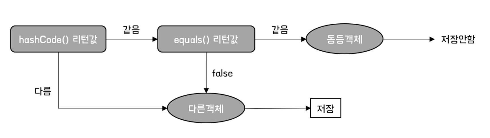

# Set
집합 컬렉션은 고유한 요소를 모아두는 것을 나타낸 인터페이스입니다. 다만, 일반적으로 삽입 순서의 보장이 되지 않습니다.

여기서 주목해야할 것은 **고유한 요소** 입니다. 이에 대해서는 추후 설명하겠습니다.

## HashSet
HashSet은 Set 컬렉션을 구현한 클래스입니다.

여기서 요소의 고유성을 구별하기 위해 **Hash**를 사용합니다.

### HashSet의 요소 구별 방법!
HashSet은 1번의 변환 과정, 1번의 비교과정을 통해 요소의 중복성을 검사합니다.

따라서, Set에 어떤 클래스 객체를 삽입하기 원하는 경우, 개발자가 원하는 **고유한 요소** 를 구별하기 위해선, hashCode, equals 메서드를 오버라이드해야합니다!
> 아무런 조치를 하지 않을경우 Object 클래스의 hashCode, eqauls를 사용합니다.