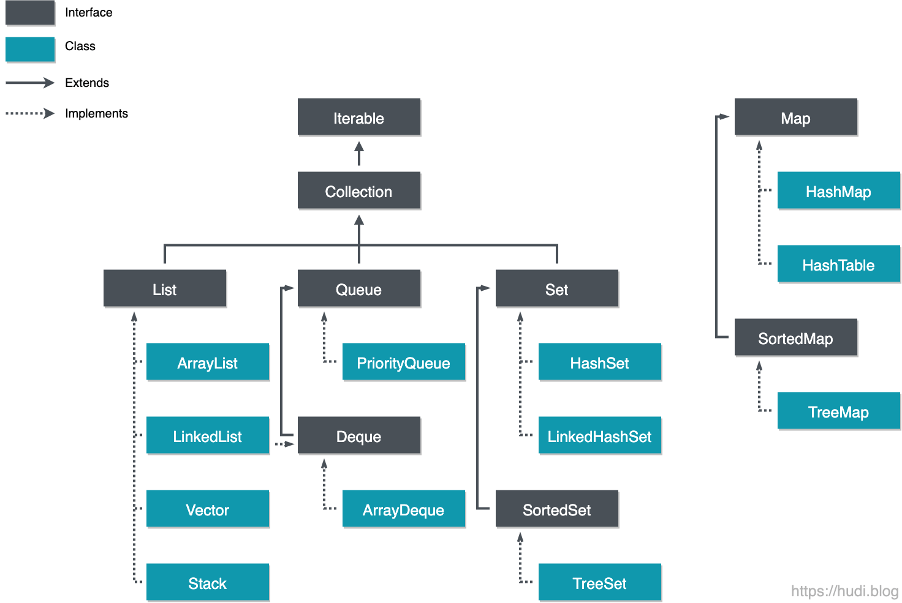

# 컬렉션
오브젝트를 모아놓은 것을 통틀어 컬렉션이라한다.

자바에선 자주 사용하는 리스트, 큐, 셋 등의 자료구조 인터페이스가 이런 컬렉션 인터페이스를 구현하거나, 상속하도록 명시되어있다.

## 컬렉션 구조

유일하게 Map은 컬렉션 인터페이스를 상속받지 않는다.

### 왜?
컬렉션 프레임워크에는 Map도 포함되는데, 인터페이스만 왜 빼놓았을까?

> The `Map` interface provides three _collection views_, which allow a map's contents to be viewed as a set of keys, collection of values, or set of key-value mappings. The _order_ of a map is defined as the order in which the iterators on the map's collection views return their elements. Some map implementations, like the `TreeMap` class, make specific guarantees as to their order; others, like the `HashMap` class, do not
							[출처:자바 SE 17 API Doc](https://docs.oracle.com/en/java/javase/17/docs/api/java.base/java/util/Map.html)

Map의 기본구조는 Key, Value 형식이다. 자바의 Collection 인터페이스는 하나의 요소를 기준으로 구분짓지만 Map은 보는 관점에 따라 Key Set, Value Set, Key-Value pair Set과 같이 3가지 관점으로 볼 수 있다.

따라서, 인터페이스의 의미를 위해 분리한 것으로 보인다.

## List
[리스트 정리](./리스트-List)